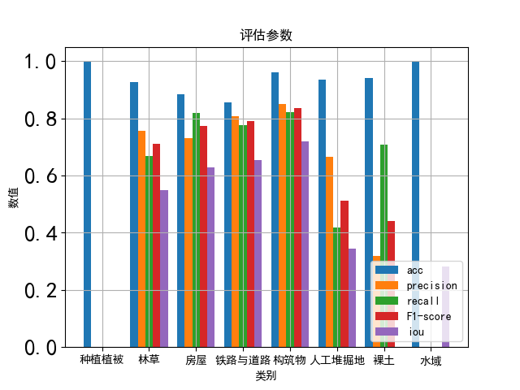

# Nested Unet Remote Sensing Semantic Segmentation

## 环境安装

通过requirems.txt安装所需的第三方库
<details><summary> <b>安装指南</b> </summary>

官网下载最新版anaconda，并安装python3.9版本

``` shell
pip install -r requirements.txt
#如果安装较慢可使用国内镜像源（例：清华源）
pip install -r requirements.txt -i https://pypi.tuna.tsinghua.edu.cn/simple
```

安装pydensecrf工具包

```shell
pip install git+https://github.com/lucasb-eyer/pydensecrf.git
```

安装gpu版本pytorch

```shell
pip3 install torch torchvision torchaudio --extra-index-url https://download.pytorch.org/whl/cu116
```

安装gdal工具包

```shell
conda install gdal
```

</details>

## 项目文件明细

├─config.py																	项目设置
├─detect_change.py													进行本地变化识别、语义分割
├─get_model_performance.py									根据验证数据验证当前模型的准确率
├─train_and_validate.py												训练并验证模型
├─export.py																	导出onnx模型
├─start_server.py														开启wsgi服务器，接收前段传输的参数

├─remotesensing_alg												传统遥感算法
|   ├─cut_images.py														根据图斑数据从遥感影像中裁剪对应图斑的影像
|   ├─fast_glcm.py															快速灰度共生矩阵计算模块
|   ├─__init__.py

├─utils																			辅助函数
|   ├─augment_semantic_segment_image.py			语义分割图像数据增强，同时加入了计算的纹理信息
|   ├─counter.py															 训练时统计训练时各种模型评估参数的状态的类
|   ├─datasets.py															自定义pytorch数据集
|   ├─gdal_utils.py														   使用gdal模块编写的一些处理遥感图像的函数
|   ├─pipeline.py															模型整体定义、训练、验证pipeline类
|   ├─polygon_utils.py													使用geojson模块编写的一些处理shp文件的函数
|   ├─transfer_style.py													包含遥感图像风格变换代码
|   ├─visualize_result.py												对地貌识别结果进行可视化展示代码
|   ├─__init__.py
|   ├─calculate_acc.py													计算模型准确率
|   ├─crf.py																		dense crf代码
|   ├─detect_change_to_block.py									将变化识别结果进行网格化代码
|   ├─conn_mysql.py														连接mysql数据库写入结果
|   ├─minio_store.py														连接minio文件数据库，将识别结果进行上传
|   ├─output_onnx.py														将pytorch模型导出为onnx模型
|   ├─segment_semantic.py											语义分割代码，进行膨胀预测
|   ├─detect_change_server_func.py							使用api进行语义分割时使用的一些处理函数
|   ├─zip_utils.py																将指定文件压缩为zip文件或者将zip文件解压

├─models
|   ├─unet.py																	构建neseted unet模型
|   ├─__init__.py


## 一、数据准备

### 不同期遥感数据对齐

自动获取指定文件夹下不同年份的遥感图像，并按照区域id进行遥感图像分辨率调整以及遥感图像对齐，结果存入 ./real_data/processed_data 之中

```shell
python ./utils/gdal_utils.py
```

### 标注文件读取

根据本地文件中的shp文件读取多边形标签，将矢量数据转换为栅格数据，并存入 ./real_data/semantic_mask 之中。

```shell
python ./ utils/polygon_utils.py
```

## 二、模型训练

模型结构图如下：


数据增强方法如下图所示：


使用以下命令进行模型训练

``` shell
python train_and_validate.py
```

以下为该程序可选参数，可以按需进行使用：

```
optional arguments:
  -h, --help            show this help message and exit
  --device DEVICE       确认训练模型使用的机器
  --console-output CONSOLE_OUTPUT
                        在控制台打印程序运行结果
  --epochs EPOCHS
  --data DATA           数据存储路径
  --label LABEL         标签存储路径
  --image-size IMAGE_SIZE [IMAGE_SIZE ...]
                        [图片宽， 图片高]
  --fp16 FP16           是否使用半精度训练，默认为True
  --model-name MODEL_NAME
                        训练使用的骨干网络模型名称
  --batch-size BATCH_SIZE
                        训练一批的图片数量
  --model-save-path MODEL_SAVE_PATH
                        模型保存路径，同时会在同目录生成一个相同名称的yaml文件保存模型各种参数变量。
  --ohem OHEM           是否使用在线难例挖掘
  --update-polygon      是否更新训练标签
  --ignore-background IGNORE_BACKGROUND
                        训练时是否忽视背景类
  --train-size TRAIN_SIZE
                        训练划分数据量
  --val-size VAL_SIZE   验证划分数据量
  --num-workers NUM_WORKERS
                        数据读取时使用的线程数量

```

根据训练的模型保存地址会同时生成对应的模型信息，信息包含如下内容：

```
OHEM loss: true
batch_size: 10
device: cuda
epochs: 100
fp16training: true
ignore background: false
image_size:
- 512
- 512
index to label:
  '01': "\u79CD\u690D\u690D\u88AB"
  '03': "\u6797\u8349\u8986\u76D6"
  '05': "\u623F\u5C4B\u5EFA\u7B51\uFF08\u533A\uFF09"
  '06': "\u94C1\u8DEF\u4E0E\u9053\u8DEF"
  '07': "\u6784\u7B51\u7269"
  08: "\u4EBA\u5DE5\u5806\u6398\u5730"
  09: "\u88F8\u571F"
  '10': "\u6C34\u57DF"
model_name: efficientnet-b1
num_classes: 9
save_path: ./output/ss_eff_b1.pth
```

模型以及模型信息保存在 ./output 之中。

## 三、模型准确率验证

```shell
python get_model_performance.py
```

输出结果：

计算出的acc, precision, recall, f1-score值图存放在 ./output/out_picture/ 中



同时会在控制台输出iou，miou 以及 fwiou 值，如下所示：

```
各类iou值为： [0.53414416 0.60477744 0.67254459 0.71330089 0.32688211 0.28998783 0 0.61927597]
平均iou值为： 0.4701141229616601
加权fwiou值为： 0.5995258460006233
```

其中大部分地貌场景的acc值都超过0.9，房屋、铁路道路的f1-score超过0.8,林草、房屋、铁路道路、水域的iou值超过0.6。

## 四、变化识别

变化识别流程图如下：


使用以下程序进行变化识别检测。

```shell
python detect_change.py
```

以下为该程序可选参数，可以按需进行使用：

```
optional arguments:
  -h, --help            show this help message and exit
  --device DEVICE       确认训练模型使用的机器
  --console-output CONSOLE_OUTPUT
                        在控制台打印程序运行结果
  --model-info-path MODEL_INFO_PATH
                        需要使用的模型信息文件存储路径
  --target-path TARGET_PATH
                        需要进行预测的图像存储路径
  --output-path OUTPUT_PATH
                        输出结果存储路径
  --change-threshold CHANGE_THRESHOLD
                        最后网格化判断网格是否变化的阈值，即如果网格中像素比例超过该阈值则判定该网格为变化区域。
  --block-size BLOCK_SIZE
                        变化区域网格化的大小。
  --mode MODE           程序运行模式，包括detect-change、segment-semantic、detect-change-shp
```

提供要进行地貌语义分割的图像文件夹名，程序会自动分割大幅遥感图像为瓦片图，并对每个瓦片图进行识别，在拼接时丢弃每张瓦片图的边缘 预测不准确的部分，结果栅格数据保存在
./output/semantic_result/tif 中， 矢量数据保存在 ./output/semantic_result/shp 中。

```shell
python detect_change.py --mode segment_semantic
```

语义分割结果样例图：


针对指定文件夹下的预处理对齐好的遥感图像文件进行变化识别，命名文件遵循以下规则：

```
年份_地区id1_地区id2.tif
```

不需要先进行地貌语义分割，直接根据文件夹下的图像文件，先进行语义分割，然后根据分割结果识别变化区域。

输出结果为分块化的变化区域图像如下图所示：

